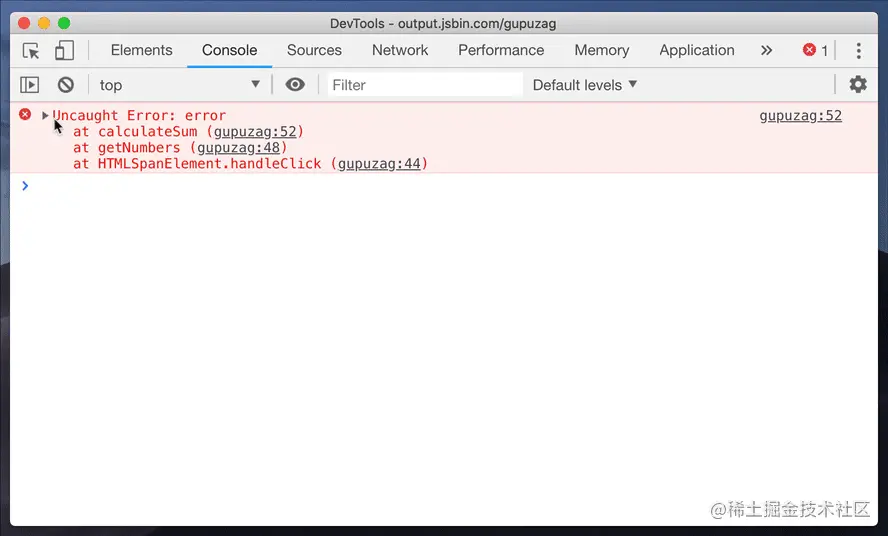
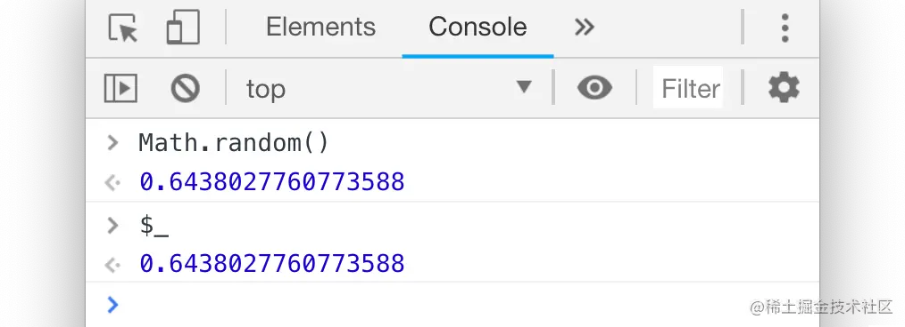

# copying & saving

在调试的过程中，我们可以使用`copy()`或者`savaing()`对`Dev Tools`里面的数据进行**复制**或者**保存**的操作。

## 1.`copy(...)`
你可以通过全局的方法`copy()`在`console`里`copy`任何你能拿到的资源。

``` js
copy(window);
copy($0);
copy($_);
```
## 2.`Store as global` (存储为一个全局变量)

如果你在`console`中打印了一堆数据 (例如你在 App 中计算出来的一个数组) ，然后你想对这些数据做一些额外的操作比如我们刚刚说的 copy (在不影响它原来值的情况下) 。 那就可以将它转换成一个全局变量，只需要**右击** 它，并选择 “`Store as global variable`” (保存为全局变量) 选项。

## 3.保存堆栈信息(`Stack trace`)



# console 中的 '$'
## 1.`$0`

在`Chrome`的`Elements`面板中，`$0`是对我们当前选中的`html`节点的引用。

理所当然，`$1`是对上一次我们选择的节点的引用，`$2`是对在那之前选择的节点的引用，等等。一直到`$4`

### `$`和 `?`

如果你没有在`App`中定义过`$`变量 (例如`jQuery`)的话，它在`console`中就是对这一大串函数`document.querySelector`的别名。

`?`代表执行了`document.QuerySelectorAll`，并且返回了包含节点的**数组**（而不是`Node List`）

### `$_`
`$_`代表对上次执行的结果的**引用**


